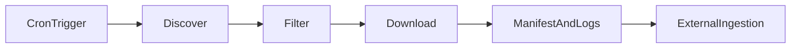

# Project board — TPI document discovery layer

This board tracks the **scheduled discovery pipeline**: find candidate climate-disclosure PDFs, filter to **new and relevant** URLs, download to a **staging hand-off** that a Problem Set 2–style ingestion pipeline can consume **without modification**.

**How to use:** Check items off as you complete them. Move bullets between sections if you treat headings as Kanban columns (Backlog → Doing → Done). Record **strategy and scope** in [`DECISIONS.md`](DECISIONS.md) (create this file per course requirements): search API vs Scrapy/Selenium vs hybrid, chosen sector, companies, relevance definition, and tradeoffs.

---

## Scope lock (do this first)

Freeze a **small, reliable** scope before building (2–4 companies, one sector).

- [ ] **Sector** chosen (one TPI sector) and named in `DECISIONS.md`
- [ ] **2–4 companies** listed with short rationale (why these sites behave predictably)
- [ ] **Sources** fixed: seed URLs, sitemap roots, investor-relations paths, and/or **frozen** search queries (no ad-hoc query drift during evaluation)
- [ ] **Definition of “relevant”** written in one testable paragraph (what counts as signal vs noise)
- [ ] **Hand-off contract** agreed: staging directory layout + manifest schema (columns/JSON fields) so downstream ingestion needs **no code changes**
- [ ] **Evaluation window** chosen (dates) for precision / coverage / latency measurement

---

## Discover

- [ ] Choose primary path: **search API**, **Scrapy/sitemap crawler**, or **hybrid**; justify in `DECISIONS.md`
- [ ] If search API: pick provider (e.g. Google CSE, Bing, DuckDuckGo, Perplexity) and document quotas/ToS constraints
- [ ] Implement **candidate URL collection** (API client or spiders)
- [ ] Normalize URLs (scheme, host, path, strip fragments; policy for tracking query params)
- [ ] Restrict to **PDF** links (or agreed MIME/extension rules)
- [ ] Enforce **domain allowlist** per company (reduce noise from aggregators)
- [ ] Respect **robots.txt** and crawl-delay where applicable
- [ ] Set honest **User-Agent** string and contact comment (best practice)
- [ ] Add **rate limiting** / backoff for HTTP and API calls
- [ ] Log raw discovery counts per source/query (for debugging)
- [ ] If hybrid: define when search supplements crawl (unknown paths vs known IR structure)

---

## Filter

- [ ] Load **stored manifest** of previously seen documents (URL and/or content id)
- [ ] Classify candidates: **new** vs **already seen** vs **irrelevant**
- [ ] Implement **relevance rules** (keywords, path patterns, title heuristics, file size bounds — match scope paragraph)
- [ ] Log **reject reason** for every filtered-out URL (essential for markers and for your report)
- [ ] Handle **HTML pages** that only link to PDFs (follow vs skip policy)
- [ ] Detect **trap URLs** (login walls, consent interstitials, 404 soft pages)
- [ ] Canonicalize **redirect chains** to a single logical URL before dedup
- [ ] Cap **max downloads per run** to stay within Actions time/storage (document the limit)

---

## Hand-off

- [ ] Download accepted PDFs to **staging** path agreed with ingestion (e.g. `staging/pdfs/` or sector/company subfolders)
- [ ] Use **atomic** or temp-then-rename writes to avoid half files
- [ ] Record **checksum** (SHA-256) or reliable `(size, etag)` in manifest
- [ ] Append or version manifest so history is inspectable
- [ ] Emit **run summary** (JSON or structured log): discovered, passed filter, downloaded, failed, skipped + reasons
- [ ] Ensure layout matches **PS2 `data/raw`-style** expectations if that is the contract (document exact tree in README)

---

## Dedup and tests (required)

- [ ] Implement dedup: at minimum **canonical URL**; ideally **content hash** after download
- [ ] **pytest**: identical URL with different query strings (policy explicit)
- [ ] **pytest**: `http` vs `https` and `www` variants collapse correctly or are rejected consistently
- [ ] **pytest**: redirect to same PDF — single logical document
- [ ] **pytest**: manifest replay — second run downloads nothing new
- [ ] **pytest**: corrupted/partial file handling (retry or quarantine)
- [ ] **pytest**: empty discovery result — pipeline exits cleanly with informative log

---

## Scheduling and CI (GitHub Actions)

- [ ] Add workflow under `.github/workflows/` with **`schedule` (cron)** plus **`workflow_dispatch`** for manual runs
- [ ] Document cron timezone (UTC) and chosen frequency/rationale
- [ ] Inject API keys via **secrets only** — never commit keys; document names in `CONTRIBUTING.md` (W07 pattern)
- [ ] Set **job timeout** appropriate for crawl + download size
- [ ] Upload **logs and/or run summary** as **artifacts** (or commit to `logs/` only if course allows — prefer artifacts)
- [ ] Pipeline exits **non-zero** on defined fatal errors; zero on successful completion with optional “no new docs”
- [ ] Verify **clean environment**: install deps from lock/env file each run

---

## Observability

- [ ] One place a marker can see **what this run did** (artifact + concise console summary)
- [ ] Counts: discovered / relevant / new / downloaded / failed
- [ ] Optional: Slack/email notification on new docs (only if low noise)

---

## Evaluation period

- [ ] Run scheduled workflow across the evaluation window (not just one manual run)
- [ ] Build a **gold or audit set**: sample of downloads labeled relevant vs noise
- [ ] Track **publication or upload time** vs **first detection time** for latency (even rough)
- [ ] List **known documents** you expect to find — check off which were detected (coverage)

---

## Report (written deliverable)

- [ ] **Precision:** fraction of downloaded docs that were genuinely new and relevant — with evidence
- [ ] **Coverage:** plausible misses — how you know, what you checked (TPI list, IR calendar, manual search)
- [ ] **Latency:** distribution or examples: time from publication to detection
- [ ] **Failure modes:** what breaks the system; retries; partial failures; how manifest recovers
- [ ] **CLEAR integration:** concrete recommendation (batch hand-off, API, ownership, auth, ops)

---

## Documentation (course requirements)

- [ ] **`README.md`:** what the pipeline does, how to run locally, how scheduling works, output layout
- [ ] **`CONTRIBUTING.md`:** dev setup, tests, **GitHub Secrets** names and setup steps, crawling ethics note
- [ ] **`DECISIONS.md`:** approach choice, scope, relevance definition, rejected alternatives, key tradeoffs
- [ ] Link this board from README for project tracking

---

## Deliverables compliance checklist

Maps directly to the project brief.

- [ ] Scheduled pipeline with three stages: **discover → filter → hand-off**
- [ ] **Decoupled** from ingestion: clean staging interface, no PS2 code changes required
- [ ] **GitHub Actions** `cron` scheduling required path exercised
- [ ] **Inspectable logs** after every scheduled run (artifact or committed summary per course rules)
- [ ] **Dedup logic covered by pytest** (explicit requirement)
- [ ] Search API keys (if any) in **GitHub Secrets** only; documented in `CONTRIBUTING.md`
- [ ] Written **report** with precision, coverage, latency, failure modes, CLEAR recommendation
- [ ] **README.md**, **CONTRIBUTING.md**, **DECISIONS.md** meet “Requirements for all teams”

---

## Questions to consider

Use these to drive design reviews and to seed `DECISIONS.md`. They are intentionally overlapping.

### Scope and stakeholders

1. Who is the **primary consumer** of the staging output (your team’s ingestion script, another repo, manual review)?
2. What does **“relevant”** mean specifically for **TPI** vs a generic “climate PDF”?
3. Are **interim reports**, **slide decks**, or **Excel** attachments in scope, or **PDF-only**?
4. How do you avoid scope creep to “**entire sector**” before the small scope works?
5. Which **language** assumptions do you make (English-only filenames/text)?
6. Do you need **per-company** config files (YAML) for URLs and allowlists?

### Relevance and precision

7. Will you use **fixed keywords**, **regex on URLs**, **path patterns**, or a **scoring rubric**?
8. What is the **cost of a false positive** (noise in staging) vs **false negative** (missed disclosure)?
9. How will you **sample and label** downloads for precision estimates?
10. Do you treat **duplicate reports** (same year, revised PDF) as new?
11. Should **file size** bounds exclude junk or one-page placeholders?
12. Do **aggregator sites** (Scribd, third-party hosts) ever count as in-scope?

### Coverage and ground truth

13. How do you know a document **should** have been found **if you never saw it**?
14. Will you maintain a **manual checklist** of expected reports per company/year?
15. Can you cross-check against **TPI’s public materials** or company IR “reports” pages?
16. What if a company **stops publishing** PDFs and uses **only HTML**?
17. What if disclosures move to a **subsidiary** domain?

### Latency

18. What is your **definition of publication time** (file `Last-Modified`, page “posted on”, press release)?
19. Is latency measured in **hours**, **days**, or **cron periods**?
20. How does **timezone** affect “same day” detection?
21. Does the search API lag **behind** the corporate site?

### Search API route

22. What are **daily/monthly quotas** and cost ceilings?
23. How do you extract **direct PDF URLs** from results (vs landing pages)?
24. How do you handle **pagination** and duplicate results across pages?
25. Are **filtered** or **personalized** results skewing repeatability?
26. Does the API **ToS** permit your use case and storage of results?
27. What happens when the API returns **zero results** — fallback crawl?

### Scrapy / Selenium route

28. Does the site expose a **sitemap**? Is it complete?
29. Are IR pages **JS-rendered** (need Selenium or Playwright — still validate with course defaults)?
30. How do you handle **infinite scroll** or **load more** listings?
31. What is the policy for **login** or **cookie consent** walls?
32. How deep do you **follow links** from the hub page?
33. What is your **ethical / legal** stance on crawling (robots, rate, institutional rules)?

### Dedup and identity

34. Do you key documents by **URL**, **content hash**, or **both**?
35. How do you treat **PDF updated in place** at the same URL?
36. How do you treat **the same file** hosted on **two URLs**?
37. Do you strip **UTM parameters** before comparing URLs?
38. How do you handle **signed or expiring URLs** (CDN)?
39. What if **Content-Disposition** filename differs from URL path?

### Hand-off interface

40. Single **`manifest.jsonl`** vs one JSON per PDF — which does ingestion prefer?
41. Is the hand-off **idempotent** if ingestion runs twice on the same staging folder?
42. How do you signal **“no new documents this run”** vs **error**?
43. Do you **quarantine** suspicious files before ingestion scans them?
44. What **metadata** must accompany each PDF (company, sector, source URL, retrieved_at)?

### GitHub Actions and ops

45. What is the **maximum PDF size** you can tolerate per run on free runners?
46. Do artifacts **expire** before markers inspect them — do you need a copy elsewhere?
47. How do you **rotate secrets** without downtime?
48. Will **forks** of the repo have broken scheduled runs (document expectations)?
49. Should heavy crawling run on **`workflow_dispatch`** only and light checks on cron?

### Failure modes and recovery

50. **Intermittent 503** — how many retries, exponential backoff?
51. **429 rate limit** — global pause vs per-host?
52. **Disk full** mid-download — partial manifest state?
53. **Manifest corruption** — backup, schema validation?
54. **Spider bug** emitting garbage URLs — guardrails?
55. **Clock skew** — does it affect logging or dedup?

### Security

56. How do you ensure **secrets never appear** in logs or artifacts?
57. What is the policy for **opening/running** untrusted PDFs on developer machines?
58. Are dependencies **pinned** to reduce supply-chain risk?

### CLEAR integration

59. Would CLEAR consume a **daily batch drop** or a **push API**?
60. Who **owns** monitoring and alerting in production?
61. What **authentication** would a production hand-off need?
62. How would **versioning** of manifests work across environments (dev/stage/prod)?

### Team process

63. Who owns **discover** vs **filter** vs **hand-off** vs **CI**?
64. What is **definition of done** for a PR (tests, log sample, doc update)?
65. What is your **pre-demo checklist** (secret set, cron verified, staging folder clean)?

### Report and evidence

66. Will you keep a **table** of each run: date, counts, link to artifact?
67. How will you show **honest** precision (including embarrassing false positives)?
68. What **screenshots or appendices** prove coverage checks were performed?

---

## Quick links

- [README.md](README.md)
- [CONTRIBUTING.md](CONTRIBUTING.md)
- [DECISIONS.md](DECISIONS.md) — **create and maintain** (approach, scope, relevance, tradeoffs)
